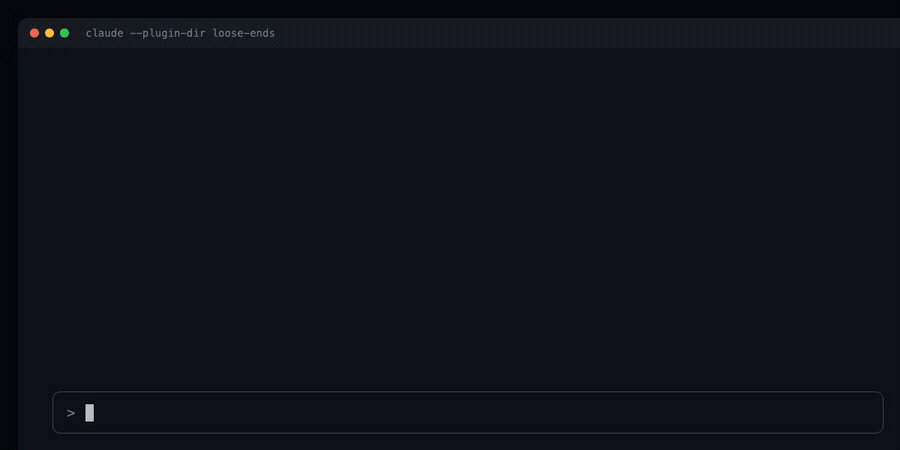

# loose-ends

A live checklist above the Claude Code prompt of the conversation's loose ends: what was raised and then left behind when it moved on. An unanswered question, a point made in passing, a caveat nobody replied to, something deferred to "later" or skipped. Not the work in progress: that one you won't forget.



<sub>The demo is a recreation of the band, with the layout, colors and flow the plugin draws.</sub>

## How it works

It is a Claude Mod: a plugin whose hooks are TypeScript functions running inside Claude Code.

- After every main-loop turn (`turn.complete`), it reads the messages the checklist has not seen yet (`$.session.messages()`) and asks Haiku (`$.model.complete`) which of them were left behind and which open items the conversation settled. The latest exchange is held back one turn: something raised there is not a loose end yet, so it is judged once the next exchange shows whether it was picked up. At most 3 items are added per turn. The call runs outside the main context: the conversation's model never sees it.
- The list is drawn in the band above the prompt (`ui.render` on `AbovePrompt`). Collapse it with `ctrl+x ctrl+a`.
- Each item's `○` is a button that checks it off (and `✓` reopens it): click it in the fullscreen layout, or press `ctrl+x tab` to focus the band, walk with `Tab` or the arrows and press `Enter`.
- Each session keeps its own list in `$.store`, so `--resume` brings it back. The last 30 sessions are kept.
- `/exit` with open items asks first, from a `command.run` hook that runs the exit only when the dialog says so. It covers `/exit` alone: `ctrl+c` and `ctrl+d` raise no event a plugin can see, and `session.end` only observes. Turn it off with `/loose-ends exit off`.
- Items you change by hand are pinned: the model never closes an item you reopened, and never adds back one you dropped.

Cost: one Haiku call per turn with the new messages (capped at about 40k characters) and the current list. It only runs in interactive sessions, never under `claude -p`.

## `/loose-ends`

| Command | What it does |
|---|---|
| `/loose-ends` | The whole list |
| `/loose-ends add <text>` | Add an item by hand |
| `/loose-ends done 2 5` | Mark items done |
| `/loose-ends undo 2` | Reopen an item |
| `/loose-ends rm 3` | Drop an item |
| `/loose-ends clear` | Empty the list |
| `/loose-ends scan` | Read the whole conversation again |
| `/loose-ends on` / `off` | Show or hide the band (off also pauses the model calls) |
| `/loose-ends rows 12` | Rows the band may take |
| `/loose-ends exit on` / `off` | Ask before `/exit` while items are open |

## Develop

Needs Claude Code 2.1.278 or later (the build its types were generated from) with `CLAUDE_CODE_ENABLE_FUNCTION_HOOKS=1` in the settings `env`.

```sh
claude --plugin-dir .      # loads from disk, hot-reloads on save
bun test
claude plugin validate .claude-plugin/plugin.json
```

For type checking, run `/plugin-types` in a session, then `bunx -p typescript tsc -p .`.

To install it for every session:

```sh
claude plugin marketplace add fernandomoraes/loose-ends
claude plugin install loose-ends@loose-ends
```
